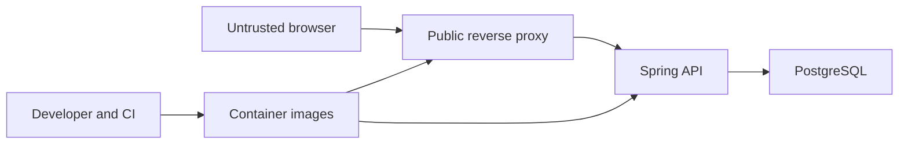

# Rill threat model

Status: implementation-grounded release-1 model; local verification complete
Last updated: 2026-07-30

## Assumption-validation check-in

- Rill is designed to be internet-facing over HTTPS, initially as a single public deployment with one API instance.
- Accounts use usernames only. Stored user data is limited to a password hash, session-token hash, typing results, and timestamps.
- There are no privileged/admin users, third-party identity providers, uploads, payments, emails, or user-authored rich content.
- The browser and network are attacker-controlled; the reverse proxy, API runtime configuration, and PostgreSQL instance are operator-controlled.
- Competitive integrity is out of scope: stored personal results may be client-tampered, so Rill makes no leaderboard or anti-cheat claim.

The target context is a public service for unrelated users. HTTPS terminates at
an operator-managed ingress in the Compose topology or at Vercel in the
documented zero-cost topology. In both cases the browser sees one origin:
`/api` is reverse-proxied to Spring rather than exposed as a browser-visible
cross-origin API. The implementation and runtime checks below were reviewed
against this boundary.

## Executive summary

The highest-risk areas are account-session theft or fixation, cross-site state changes against cookie-authenticated users, ownership mistakes in result/export/delete endpoints, and resource abuse of authentication/result APIs. Rill reduces these risks with random revocable sessions whose raw values never enter storage or logs, explicit CSRF protection, principal-derived ownership, bounded DTOs/database constraints, password hashing, a constrained same-origin deployment, per-username throttling, and a process-global pre-work authentication budget. Client score tampering remains an accepted low-impact limitation because results are private and non-competitive.

## Scope and assumptions

In scope:

- planned browser, Nginx, Spring Boot API, and PostgreSQL runtime described in `docs/architecture/ARCHITECTURE.md`;
- frontend and backend source, migration/configuration, container, and CI paths planned there;
- registration, login, logout, account export/deletion, result persistence/history, and guest local storage.

Out of scope:

- TLS certificate issuance/rotation and host hardening;
- PostgreSQL provider/host controls and backups beyond documented operator requirements;
- email/OAuth/admin/social systems because they are not in release 1;
- prevention of a user fabricating their own private score.

No service-context question remains open for release 1. Infrastructure-provider controls and expected traffic volume remain operator-specific.

## System model

### Primary components

- Browser SPA: untrusted execution environment; owns live typing state and guest preferences/history.
- Browser edge: Nginx in Compose or Vercel in the zero-cost topology; serves static assets and same-origin `/api` proxying.
- Spring Boot API: security boundary for authentication, authorization, validation, score derivation, and persistence.
- PostgreSQL: operator-controlled persistence for users, session hashes, and results.
- CI/build tooling: developer-controlled dependency/build inputs; separate from production runtime.

### Data flows and trust boundaries

- Internet browser → Nginx: credentials, CSRF token, opaque session cookie, result payloads over HTTPS; browser input is untrusted and payload sizes are bounded.
- Nginx → Spring API: same-origin `/api` requests; proxy headers are trusted only when explicitly configured and overwritten by the bundled proxy.
- Spring API → PostgreSQL: parameterized ORM/JDBC operations using a DML
  application role; a one-shot Flyway service uses a separate non-superuser
  schema owner, while a third bootstrap administrator stays outside both
  application containers.
- Spring API → browser: JSON DTO/problem responses and Set-Cookie headers; no entities, stack traces, hashes, or secrets.
- Developer/CI → images/artifacts: lockfile/Maven-resolved dependencies and build outputs; reproducible installs and audits reduce supply-chain drift.

#### Diagram

## Assets and security objectives

| Asset | Why it matters | Security objective |
| --- | --- | --- |
| Password hashes | Offline cracking could compromise reused credentials | Confidentiality, integrity |
| Raw session cookie | Possession authorizes an account | Confidentiality, integrity |
| Session-token hashes | Enable session lookup/revocation; should not become raw credentials | Confidentiality, integrity |
| Typing history | Low-sensitivity personal activity and record integrity | Confidentiality, integrity, availability |
| Account/export/delete boundary | Must affect only the authenticated account | Integrity, confidentiality |
| Database credentials/config | Could expose or destroy all stored data | Confidentiality, integrity |
| Build artifacts/dependencies | Compromise executes in browser/server trust zones | Integrity |
| API availability | Needed for account features, though guest typing remains local | Availability |

## Attacker model

### Capabilities

- Send arbitrary HTTP requests and malformed JSON to public endpoints.
- Control browser input, local storage, timing/result payloads, and their own account.
- Host a malicious cross-origin page and induce a signed-in user to visit it.
- Repeatedly attempt registrations/logins/result writes within network limits.
- Inspect all delivered frontend assets and public API responses.

### Non-capabilities

- Direct host/database/CI access without a separate infrastructure compromise.
- Reading an HttpOnly cookie through ordinary frontend JavaScript.
- Becoming an administrator because the product has no privileged role.
- Converting a fake private score into a public competitive advantage because there is no leaderboard.

## Entry points and attack surfaces

| Surface | How reached | Trust boundary | Notes | Evidence anchor |
| --- | --- | --- | --- | --- |
| Auth endpoints | Public `/api/auth/*` | Browser → API | Password/body abuse, enumeration, session issuance | `backend/.../auth/` |
| Session filter/cookies | Every authenticated API request | Browser → API | Theft, fixation, expiry, logging | `backend/.../auth/SessionAuthenticationFilter.java` |
| Result creation | Authenticated POST | Browser → API | Oversized/fabricated counts/samples | `backend/.../result/` |
| History/summary | Authenticated GET | API → browser | Cross-account data exposure | `backend/.../result/` |
| Export/delete | Authenticated account routes | Browser → API | High-impact ownership and CSRF boundary | `backend/.../auth/` |
| SPA storage/rendering | Browser runtime | API/storage → DOM | Tampered local data, DOM XSS, token storage | `frontend/src/` |
| Proxy/config | Public request routing | Internet → runtime | Header spoofing, unsafe caching, missing headers | `ops/nginx/default.conf`, `compose.yaml` |
| Migration/build pipeline | Deploy/CI | Developer → runtime | Dependency or artifact compromise | `pom.xml`, lockfile, workflows |

## Top abuse paths

1. Attacker submits repeated credential guesses → bypasses or exhausts a weak limiter → obtains a valid session → reads/deletes victim data.
2. Malicious site causes a signed-in browser to POST → absent/weak CSRF validation accepts ambient cookie → result/account state changes.
3. Authenticated attacker supplies another user identifier or guesses an id → endpoint trusts request data instead of principal → cross-account history disclosure/deletion.
4. Attacker steals a raw session from logs/database/browser-accessible storage → replays it before expiry → impersonates user.
5. Attacker posts extreme counts or a huge pace array → expensive validation/JSON/database work → API availability degradation or corrupt metrics.
6. Tampered API/local-storage string reaches an HTML injection sink → script executes in Rill origin → performs authenticated actions.
7. Spoofed forwarding headers defeat per-IP limits or secure-cookie decisions → brute-force protection weakens or cookies are misconfigured.
8. Compromised dependency/build input ships malicious client/server code → session/data compromise across users.

## Threat model table

| Threat ID | Threat source | Prerequisites | Threat action | Impact | Impacted assets | Existing/planned controls | Gaps | Recommended mitigations | Detection ideas | Likelihood | Impact severity | Priority |
| --- | --- | --- | --- | --- | --- | --- | --- | --- | --- | --- | --- | --- |
| TM-001 | Remote attacker | Public auth endpoint and guessed/reused password | Credential stuffing or auth resource abuse | Account takeover or API degradation | Sessions, history, availability | Password hashing, generic failures, bounded input, per-IP and per-account limiters, bounded password-confirmation attempts | Single-instance limiter; no breached-password service | Edge/shared limiter before scaling; login-failure metrics | Count failures/429 by route and address | Medium | High | High |
| TM-002 | Malicious website | Victim signed in with cookies | Forge state-changing request | Create data, logout, or attempt deletion | Account/result integrity | CSRF token/header, SameSite, same-origin CORS | Misconfigured proxy/origin could weaken defense | Test every mutating route without/with invalid token; validate Origin where practical | CSRF rejection counters | Medium | High | High |
| TM-003 | Authenticated attacker | Object reference endpoint accepts untrusted owner id | Read/change another account’s data | Personal data disclosure/deletion | History, account | Principal-derived queries, no client user id, repository methods scoped by user | Implementation regression | Negative authorization integration tests for every endpoint | 403/404 anomaly and account-action audit events | Medium | High | High |
| TM-004 | XSS/log/DB attacker | Raw session exposed or weak token | Replay session | Account impersonation | Session, history | 256-bit token, only SHA-256 hash stored, HttpOnly/Secure/SameSite cookie, expiry/revocation, log redaction | No device/session UI in release 1 | Rotate on login, revoke on logout/delete, test cookie flags, never log header/cookie | Invalid/expired session counts; unusual session use | Low | High | High |
| TM-005 | Remote attacker | Result/auth bodies insufficiently bounded | Send oversized/extreme payloads | CPU/memory/DB pressure, invalid records | Availability, result integrity | HTTP body limit, DTO/derived-metric bounds, allowlists, pre-database request quota, write/export limits, 1,000-row retention, aggregate summaries, DB checks, pagination | No distributed WAF | Pace sample/count caps; server-derived score; request timeout; edge limits | 4xx size/range counters and latency | Medium | Medium | Medium |
| TM-006 | API/storage attacker | Unsafe DOM sink or unsafe URL | Inject active content | Authenticated browser compromise | Session-bound actions, data | React escaping, no raw HTML feature, CSP, no third-party scripts, no auth in storage | Browser extensions remain out of control | Ban dangerous sinks; static grep; strict headers | CSP reports if an endpoint is added | Low | High | Medium |
| TM-007 | Remote attacker | Proxy headers trusted from arbitrary clients | Spoof client/proto/origin metadata | Bypass limiter or weaken cookie assumptions | Sessions, availability | API does not derive cookie security from forwarded scheme; backend port private; bundled/external proxies overwrite headers and own source limits | Operator can misconfigure custom ingress | Document trusted-proxy boundary; runtime configuration test | Compare proxy/peer behavior in deployment checks | Medium | Medium | Medium |
| TM-008 | Supply-chain attacker | Compromised dependency or drifting install | Execute during build/runtime | Broad code/data compromise | All runtime assets | Maven lock-by-version management, npm lockfile/CI frozen install, minimal dependencies, audits | Registries remain external trust | Dependabot, CodeQL, review updates, signed release provenance later | CI audit alerts | Low | High | Medium |
| TM-009 | Authenticated user | Client controls score inputs | Fabricate private personal record | Misleading personal data | Result integrity | Server formula/range validation; no leaderboard | Cannot prove physical typing from browser payload | Keep results private/non-competitive; document trust limit | Flag impossible rate/count combinations | High | Low | Low |

## Criticality calibration

- Critical: pre-auth remote code execution, database credential disclosure, or an auth bypass exposing every account. None is expected by design.
- High: reproducible account takeover, cross-account export/delete, or stored XSS affecting other users.
- Medium: targeted API denial of service, limiter bypass, partial metadata disclosure, or an XSS precondition limited to the attacker’s own browser state.
- Low: fabrication of one’s private score, low-value version disclosure, or noisy failures with straightforward recovery.

## Focus paths for security review

| Path | Why it matters | Related threats |
| --- | --- | --- |
| `backend/src/main/java/com/rill/typing/auth/` and `config/SecurityConfiguration.java` | Session resolution, CSRF/CORS/headers, proxy trust, rate limits | TM-001, TM-002, TM-004, TM-007 |
| `backend/src/main/java/com/rill/typing/auth/` | Password handling, session lifecycle, export/delete | TM-001–TM-004 |
| `backend/src/main/java/com/rill/typing/result/` | Ownership, bounds, canonical scoring, pagination | TM-003, TM-005, TM-009 |
| `backend/src/main/resources/db/migration/` | Uniqueness, foreign keys, cascades, range checks | TM-003–TM-005 |
| `backend/src/main/resources/application*.yml` | Secret/config and production defaults | TM-004, TM-007 |
| `frontend/src/api/` | CSRF, credential handling, fixed-origin requests, errors | TM-002, TM-006 |
| `frontend/src/features/account/` | No secret storage and safe account actions | TM-002, TM-004, TM-006 |
| `frontend/src/features/typing/` | Bounded local/result data and integrity assumptions | TM-005, TM-009 |
| `ops/nginx/default.conf` | Same-origin routing and browser security headers | TM-002, TM-006, TM-007 |
| `.github/workflows/` | Dependency/build trust and secret handling | TM-008 |

## Implemented control evidence

- `SecurityConfiguration` requires CSRF for every mutation, installs defensive
  headers, leaves CORS disabled unless an exact development allowlist is
  configured, and derives authorization from the authenticated principal.
- `SessionService` generates opaque random tokens, stores only their SHA-256
  hashes, applies absolute expiry/session caps, and clears cookies on
  logout/deletion.
- DTO validation, a 64-KiB application/proxy body limit, pace-bucket bounds,
  request timeouts, pagination limits, result quotas, and database checks bound
  attacker-controlled work.
- JPA repositories use parameter binding; entities are not API response types.
  Result queries, export, and deletion derive the account from the principal.
- React renders ordinary escaped text and contains no `dangerouslySetInnerHTML`
  or user-derived navigation destination. The CSP disallows inline and
  third-party scripts.
- Compose separates a bootstrap administrator, non-superuser migration owner,
  and DML-only runtime role; it revokes runtime access to Flyway history before
  application startup and uses private backend/data networks, read-only
  application filesystems, dropped capabilities, and `no-new-privileges`.
- The npm production dependency audit is part of CI. Dependabot covers npm,
  Maven, container base images, and workflow actions.

The final verification record contains the exact automated and runtime commands;
this model does not treat planned CI runs as executed evidence.

## Residual and accepted risk

| Risk | Decision |
| --- | --- |
| Fabricated private scores | Accepted because there is no public competition; ranges and formulas are still server-validated. |
| Single-instance rate limiting | Accepted for one API instance. The process-wide minute/hour budgets bound database and BCrypt work even on the public Render origin, but reset on process restart and do not coordinate across replicas. A shared edge/store limiter is required before horizontal scaling. |
| Authentication-budget denial | A caller can consume the 30-attempt minute budget or 60-registration hour budget and temporarily deny legitimate authentication. This is accepted for the single-instance free launch because the alternative permits unbounded expensive work; monitor 429 rates and move to source-aware shared throttling before material traffic. |
| Targeted username lockout | Ten failed attempts can delay that username for up to 15 minutes. The Compose edge IP limiter reduces single-source abuse but not distributed attempts; an internet-scale deployment should use shared source-plus-account progressive throttling and monitor lockout rates. |
| No password recovery or MFA | Accepted for the no-email release-1 scope and disclosed to users/operators. |
| No in-repository TLS/host hardening | Owned by the documented operator-managed ingress/platform boundary. |
| Browser extensions or compromised client device | Outside the web application's control; HttpOnly cookies reduce ordinary script exposure. |
| Dependency registry/build compromise | Reduced by exact npm locks, pinned direct Maven/base-image versions, clean CI installs, minimal dependencies, and recurring review; not eliminated. |

## Quality check

- Implemented public entry points and all browser/proxy/API/database/build trust
  boundaries are represented.
- Runtime threats are separated from CI/build threats.
- Evidence anchors point to actual repository paths.
- High-impact authorization, CSRF, session, input-bound, and configuration
  controls have automated negative tests.
- Deployment-platform responsibilities and release-1 accepted risks are
  explicit rather than presented as application guarantees.

## Zero-cost topology addendum

The Vercel rewrite preserves one browser-visible origin, but the Render API
hostname is still public. A caller can bypass Vercel and consume Render or Neon
free-tier quota. Spring authentication, CSRF checks, request bounds, validation,
per-username login throttling, and pre-work process-global authentication
budgets still apply; they do not create a private origin or a distributed
denial-of-service boundary. This availability risk is accepted for the
single-instance hobby deployment. Provider usage and 429 rates must be
monitored, and a shared source-aware edge limiter or private origin is required
before horizontal scaling.

Render starts Flyway inside the Spring process before opening the application
pool. The process therefore holds both the non-superuser schema-owner secret
and the DML-only runtime secret. The runtime pool uses only the latter, all
database URLs require `sslmode=verify-full`, `channelBinding=require`, and
pgJDBC's `DefaultJavaSSLFactory` so the container uses the JVM trust store, and
neither secret may enter source, frontend configuration, build arguments, or
logs. Arbitrary server-code execution could still read both secrets; accepting
that residual risk is specific to this free topology.

Provider Git-triggered deployments are disabled. Releases are manual and
backend-first because a failed or backward-incompatible Flyway migration cannot
be rolled back by Render health gating after it changes the shared database.
Future schema changes must use expand/contract releases, with an operator backup
and public-origin smoke checks as documented in
`docs/operations/FREE_TIER_DEPLOYMENT.md`.
